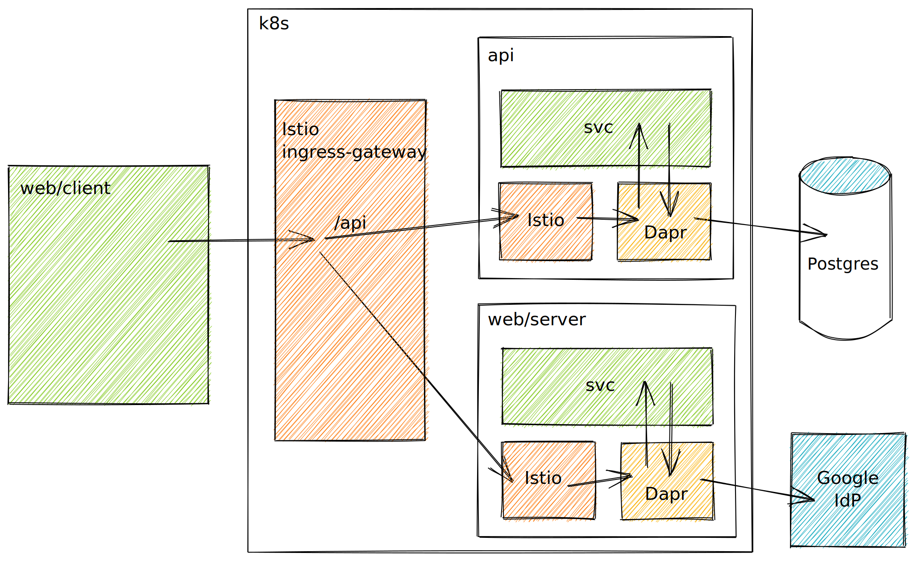

# Todo MVC example

The ubiquitous [TodoMVC][todomvc] client-side web application, written in Rust, with a [GraphQL][graphql] API over a PostgreSQL database, and authentication with Google OAuth2 implicit flow.

The following diagram shows the target setup in Kubernetes, with Istio and Dapr sidecars in each pod. An Istio `VirtualService` routes `/api` requests to the `api` service via the Istio and Dapr sidecars.



## Known issues

1. You'll need a `web/manifests/secret.yaml` file with fields for `client_id` and `client_secret`.

1. The Istio `VirtualService` currently points to the K8s service rather than the Dapr sidecar. When we point the `/api` route to Dapr, we get `431 Headers too large` (because of the cookies). I don't think Dapr should complain about 2KB cookies, but we'd have to round trip the auth values a different way to get round this.

1. The `rc.3` release has a [bug](https://github.com/dapr/dapr/pull/2667) around loading HTTP middleware which is fixed but not released, so we can't use the OAuth2 middleware unless we revert to `0.11`. (there is a separate branch for this, although I still can't get it to work with a GCP OAuth2 config).

1. Pushing the SQL through the Dapr Postgres building block is probably not sensible right now. Hard to work out whether the loss of `sqlx` is a price worth paying. Maybe should use a simpler state store, or work out what using `sqlx` and `Dapr` means (maybe there's a Dapr provider we can write?).

1. The Zipkin config might not be right as I haven't tested it yet.

---

## To get started

1. Install the `istioctl` cli, and the `dapr` cli, if you don't already have them.

   ```sh
   brew install istioctl
   brew install dapr-cli@1.0.0-rc.3
   ```

2. Install Istio and Dapr

   ```sh
   istioctl install
   dapr init --runtime-version 1.0.0-rc.2 --kubernetes
   ```

3. Install Zipkin into the cluster for tracing (will bring this into manifests later):

   ```sh
   kubectl create deployment zipkin -n default --image openzipkin/zipkin
   kubectl expose deployment zipkin -n default --type ClusterIP --port 9411
   ```

   To view the Zipkin dashboard:

   ```sh
   kubectl port-forward -n default svc/zipkin 9412:9411
   open http://localhost:9412
   ```

4. Apply system-wide manifests

   This will install a `gateway` resource in the `istio-system` namespace, to route HTTP traffic to our virtual services.

   ```sh
   (cd manifests && make)
   ```

5. Follow the Web UI [readme](./web/README.md)
6. Follow the API [readme](./api/README.md)

[graphql]: https://github.com/graphql/graphql
[todomvc]: http://todomvc.com/
